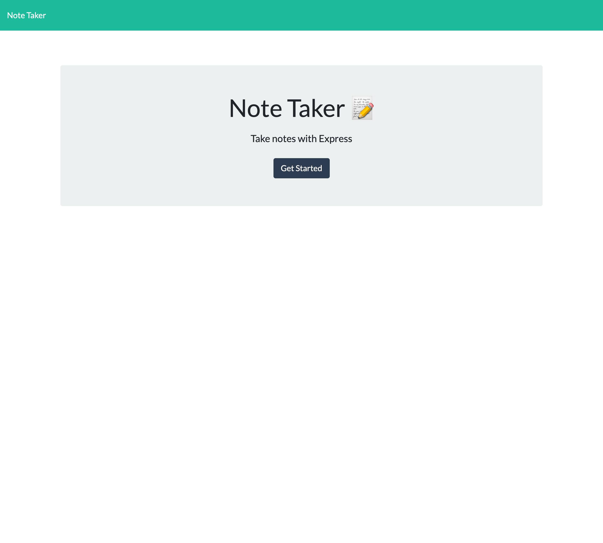
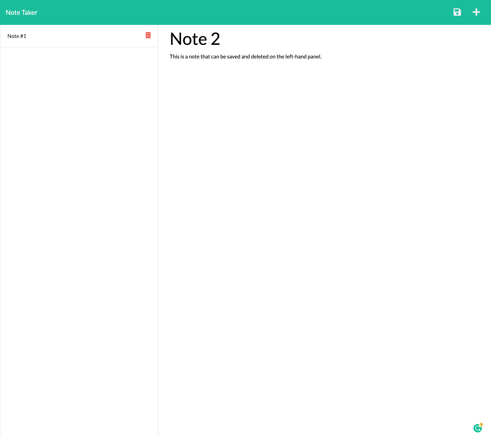

# Note Taker Express

## Table of Contents
1. [Description](#description)
2. [Usage](#usage)
3. [Visuals](#visuals)

## Description
---
This is a note taking application created for a small business owner to organize thoughts and keep track of tasks. This application is made using Express.js.

## Usage
---
When deploying the application, you can create a note and save to the left hand side panel using the floppy disk icon. If the item needs to be deleted you can press on the delete icon to remove the individual note.

## Visuals
---

    

